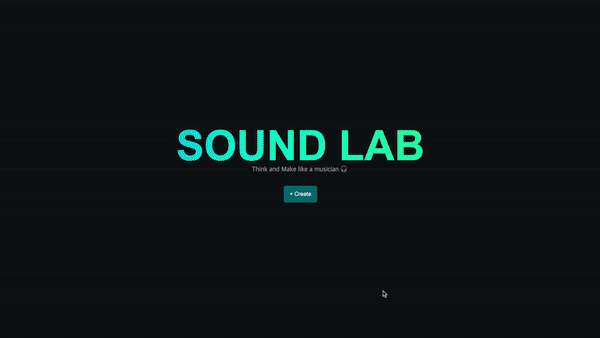
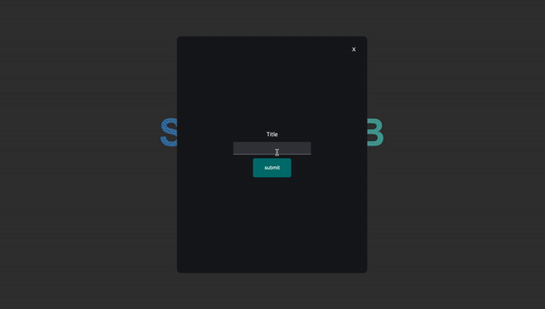
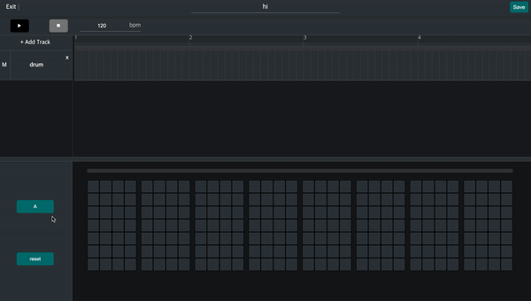

# [Sound LAB🎧](https://www.soundlab.agency/)

[](https://app.netlify.com/sites/awesome-tesla-be23da/deploys)



- **Sound LAB**은 시퀀서를 웹용으로 제작한 작곡 서비스입니다.
- **간단한 조작법**으로 손쉽게 작곡할 수 있도록 제작되었습니다.

---

<br>

## **Contents**

- [**Sound LAB 🎧**](#Sound-LAB🎧)
- [**Contents**](##Contents)
- [**Motivation**](##Motivation)
- [**작업 기간**](##작업-기간)
- [**Git Work Flow**](##Git-Work-Flow)
- [**배포**](##배포)
- [**듀토리얼**](##듀토리얼)
- [**주요기능**](##주요기능)
- [**Usage**](##Usage)
- [**기술 스택**](##기술-스택)
- [**기술적 챌린지**](##기술적-챌린지)
- [**프로젝트를 마치면서**](##프로젝트를-마치면서)

<br>

---

<br>

## **Motivation**

**Sound LAB**은 작곡 서비스입니다. 과거에 참여했던 팀 프로젝트에서 WebRTC를 이용하여 서비스를 구현했었습니다. 프로젝트를 하면서 Web API에 대해 자연스럽게 흥미가 생겼고 다양한 Web API에 도전해보고 싶었습니다. 평소 음악을 즐겨듣고 디제잉에 관심이 있어 오디오와 관련된 Web API를 조사해보다 Web Audio API를 이용한 사운드랩을 구상하게 되었습니다.

<br>

---

<br>

## **작업 기간**

- ### 1주차

  기획 및 디자인 작업

  - [mock up](https://www.figma.com/file/cwVxZc79tIkGxtGttjPoRe/Sound-Lab?node-id=0%3A1)

- ### 2, 3주차

  개발 및 배포

  - 기능 구현
  - 피드백 반영 및 문서 작성

<br>

---

<br>

## **Git Work Flow**

- 기능별로 feature 브랜치 생성 후 개발
- 단위 기능 완료 후 master 브랜치로 병합

<br>

---

<br>

## **배포**

- ### Client

  Netlify

  URL: https://www.soundlab.agency

- ### Server

  AWS Elastic BeanStalk

  URL: https://api.soundlab.agency

<br>

---

<br>

## **듀토리얼**



- 메인 페이지에서 **곡 타이틀**을 입력합니다.
- **작곡 페이지**로 화면이 이동합니다.
- **샘플 파일**이 제공되고 **재생**해 확인할 수 있습니다.
- **트랙 추가**를 클릭한 후 악기를 선택합니다.

  트랙 추가 시 선택한 악기에 따라 화면 하단에 곡은 편집할 수 있는 **시퀀서**가 세팅됩니다. 동시에 트랙 리스트에 선택한 악기의 **트랙이 추가**됩니다.

- 화면 하단 시퀀서 블럭을 클릭하면서 곡을 편집합니다.
- 곡을 저장한 후 URL을 통해 공유할 수 있습니다.

<br>

---

<br>

## **주요기능**

- **시퀀서**

  

1. 32박자의 시퀀서 블럭이 16마디 씩 A파트 B파트 나눠서 화면에 세팅됩니다.

2. 각 박자에 해당하는 시퀀서 블럭을 클릭하면 해당 마디에 소리가 입력됩니다.

3. 각 파트에 해당하는 변경 사항이 화면 상단 악보에 반영됩니다.

4. 재생하는 동안에도 편집이 가능합니다.

<br>

- **트랙 리스트**

  

1. 트랙이 순차적으로 트랙 리스트에 추가됩니다.

2. 트랙별 삭제, 음소거를 할 수 있습니다.

3. 편집을 원하는 트랙을 클릭하면 화면 하단 시퀀서가 트랙에 맞는 악기로 변경됩니다.

  <br>

- **BPM** 조절 기능

  화면 상단에 있는 bpm 조절칸에서 원하는 속도를 입력하면 재생 **속도를 변경**할 수 있습니다. 최대 240 최저 40 bpm입니다.

- **URL** 공유 기능

  곡을 저장했을 경우 URL을 통해 곡 편집 페이지로 접근 가능합니다.

<br>

---

<br>

## **Usage**

- Requirements

  - 최신 버전의 Chrome Browser 사용을 권장합니다.
  - Local에서 실행하기 위해 사전 준비가 필요합니다.

    - [Mongo DB](https://www.mongodb.com/)

- Installation

  Root 디렉토리에 .env 파일을 생성하고, 다음 환경변수를 입력하고 실행합니다.

  - Front-end

    ```jsx
    REACT_APP_SOUND_LAB_PUBLIC_URL=https://api.soundlab.agency/
    ```

    ```jsx
    $ git clone https://github.com/sound-Lab/sound-Lab-client.git
    $ cd sound-Lab-client
    $ npm install
    $ npm start
    ```

  - Back-end

    ```jsx
    MONGO_DB_URL>
    ```

    ```jsx
    $ git clone https://github.com/sound-Lab/sound-Lab-server.git
    $ cd sound-Lab-server
    $ npm install
    $ npm run dev
    ```

<br>

---

<br>

## **기술 스택**

- ### Front End

  React │ Redux Saga │ Tone.js │ Styled-components

- ### Back End

  Node.js │ Express │ MongoDB Atlas & Mongoose

<br>

- ### 스택 선정 이유

  - React

    유저의 곡 편집 그리고 재생됨에 따라 빈번하게 일어나는 변화를 효과적으로 렌더링하기 위해 React를 사용했습니다.

  - Redux Saga

    곡 편집에 따라 빈번하게 일어나는 트랙 상태 변화를 공유하고 있는 컴포넌트가 다수 존재하기에 전역 상태 관리의 필요성을 느꼈고 Redux를 도입했습니다.

    React 컴포넌트와 비동기 요청 로직의 관심사 분리를 위해 Middleware로 Redux-saga를 도입하였습니다. saga를 선택한 이유는 비동기 요청을 동기적으로 작성할 수 있다는 점 그리고 사이드 이팩트를 순수하게 관리할 수 있다는 점에서 선택했습니다.

  - Tone.js

    곡 재생, 음원 파일 로드 등 오디오와 관련된 기능을 구현하기 위해 선택했습니다.
    Tone.js는 음악 제작을 위한 프레임워크로 Web audio API를 기반으로 만들어졌습니다. 기능 구현에 관련된 다양한 메서드와 자료를 제공한다고 판단하여 선택했습니다.

    Web audio API 관련 메서드를 제공하는 프레임워크 중 p5.js를 선택하지 않은 이유는 p5.js는 소리 시각화 기능에 특화되어있어 프로젝트의 목적에 부합하지 않다고 판단하여 선택하지 않았습니다.

<br>

---

<br>

## **기술적 챌린지**

<br>

- ### **음악 객체 구조 구성**

  다양한 악기의 소리가 각각의 음을 내면서 재생될 수 있도록 아래와 같은 형태로 트랙을 구성했습니다.

  - **음악 트랙**

    하나의 음악 객체는 tracks 배열로 구성되어 있고, 각 트랙은 마디 배열과 스탭 배열 그리고 선택된 악기의 코드 정보가 들어있습니다.

    트랙 구조를 구현하기 위해 design pattern 중 factory pattern을 활용하여 트랙 객체 생성 환경을 단순화했습니다.
    util함수를 작성하여 트랙 객체 생성. 각 트랙이 동일한 형태를 유지할 수 있도록 했습니다.

    생성된 steps 배열은 유저의 입력에 따라 0, 1으로 **추상화**하여 사용했습니다.

    > 1. factory 패턴을 차용하여 util 함수 작성
    > 2. 트랙 추가 시 해당 util 함수 실행. 트랙에 필요한 값 추가

      <details>
      <summary><span>트랙 생성 코드</summary>

    ```jsx
    function initialSteps() {
      const tracks = {};

      tracks.codeName = codes;
      tracks.bars = Array(16).fill(0);
      tracks.steps = codes.map((code) => ({
        code,
        stepList: Array(64).fill(0),
      }));

      return tracks;
    }
    ```

      </details>

      <br>
    위와 같은 구조로 트랙 객체 생성 환경을 단순화할 수 있었지만 factory pattern을 제대로 활용하지 않아 아쉬움이 남습니다. 하지만 design pattern에 대해 고민할 수 있었습니다.

  <br>

  - **음악 progress bar 구성**

    재생 시간을 시각화하기 위해 재생중인 스탭의 index를 비율 치환하여 사용했습니다.

    > 1. 유저가 입력한 bpm에 60초를 나눈 후 그 값에 16마디를 곱해 progress bar time을 산출했습니다.
    > 2. ProgressBar component의 props로 산출해낸 값을 내려주었습니다.
    > 3. styled-components의 특징 중 props를 이용할 수 있는 점을 이용하여 건내받은 값을 이용하여 재생 시간을 시각화하였습니다.

      <details>
      <summary><span>Progress bar 시각화 코드</summary>

    ```jsx
    const ProgressBar = styled.div`
      animation: ${(props) => `progressAnimationStrike ${props.time}s linear`};
      animation-iteration-count: infinite;

      @keyframes progressAnimationStrike {
        from {
          width: 0;
        }
        to {
          width: 100%;
        }
      }
    `;
    ```

      </details>

    <br>
    위와 같은 구조로 별도의 데이터 구현없이 재생 시간을 시각화할 수 있었습니다.

<br>
<br>

- ### **저장**

  - 문제

    새로고침과 URL 접근에 대응하기 위해 곡 저장 기능을 기획했습니다. 초기 기획 단계에 트랙을 추가할 때마다 선택한 악기에 따라 해당 악기 sample 객체를 로드한 후 리덕스에 보관, 저장 시 악기 sample 객체와 함께 데이터 베이스에 저장하는 방식을 구상했습니다. 하지만 구현 단계에서 악기 음원 sample 객체가 데이터베이스에 저장되지 않는 문제가 발생했습니다.

  - 원인

    Tone.js를 이용해 로드한 음원 sample 객체는 Audio context 형태로 변환되어 브라우저에서 사용되었고 데이터 베이스에 저장할 수 없었습니다. 그렇기 때문에 곡 편집 화면에 진입했을 때 Audio context를 새롭게 형성해야 했습니다.

  - 해결 방법

    기존에 기획하였던 방식(트랙 선택시 sample객체 로드)이 아닌 화면에 진입했을 때 모든 sample 객체를 로드 후 리덕스 상태로 저장. 트랙 추가 시 선택된 악기에 따라 저장된 음원 sample 객체를 리덕스에서 가져와 사용하는 방식으로 구조를 변경했습니다.

    시도한 구조 변경은 아래와 같습니다.

    > 1. 곡 저장 시 음원 sample 객체 제외, 편집된 마디 정보만 데이터 베이스에 저장.
    > 2. 기존에 트랙을 추가할 때마다 선택된 악기 음원 sample 객체를 로드하는 구조에서 곡 편집 화면에 진입했을 때 모든 악기 sample 객체를 로드하여 Audio context로 변환하는 구조로 변경.

  - 결과

    위와 같은 변경으로 곡 편집 화면에 진입했을 때 로딩에 1초 정도의 시간이 소요되었으나 기존에 트랙을 추가할 때마다 악기 음원 sample 객체를 로드하기 위해 소요되던 시간을 절감할 수 있었고 URL을 통한 접근 그리고 새로고침에 대응할 수 있게 되었습니다.

<br>
<br>

- ### 자동 재생

  - 문제

    이전 팀 프로젝트 때 브라우저별로 구현되어있는 메서드가 상이해 디버깅에 어려움을 겪었던 경험이 있어 Chrome 브라우저 그리고 Opera 브라우저를 이용해 개발을 진행했습니다. 그러던 중 Chrome 브라우저에서 저장했었던 곡 편집 화면에 진입했을 때 재생되지 않는 문제가 발생했습니다.

  - 원인

    재생이 되지 않았던 이유는 Chrome 브라우저에서 비교적 최근에 개정한 Chrome 71 auto play policy 때문이었습니다. 내용은 유저의 action(ex. click, key down)이 없으면 Audio Context의 상태가 suspended로 생성되어 자동 재생이 불가능하다는 것이었습니다.

    당시 play button 클릭 이전 Audio Context를 재생할 수 있는 상태로 변경해주는 로직이 없다는 사실을 파악했습니다.

  - 해결 방법

    문제를 해결하기 위해 아래와 같이 변경을 진행했습니다.

    > 1. 곡 편집 화면에 유저가 진입했을 때 AudioContext의 state 확인.
    > 2. suspended일 경우 resume 상태로 변경하여 play button을 클릭했을때 resume 상태로 재생

  - 결과

    위와 같은 변경으로 Chrome 브라우저에서도 저장된 곡을 바로 재생할 수 있도록 대응할 수 있었습니다. 다양한 브라우저 환경에서 테스트하고 대응해야한다는 점을 되새겼습니다.

<br>

---

<br>

## **프로젝트를 마치면서**

- 기획부터 개발까지 혼자 해야 하는 상황에 스트레스를 받고 개발 일정이 더디게 진행되면 초조함에 잠 못 들기도 했습니다. 개인 프로젝트를 진행하면서 팀 프로젝트와 다르게 모든 문제를 스스로 해결해나가야 한다는 점이 힘들때도 있고 동료들과 함께 문제를 해결하면서 협력하던 때가 그립기도 했습니다. 하지만 직면한 문제에 대해 다양한 관점으로 접근해보려 했던 경험이 개인적 성장에 많은 도움이 되었습니다.
